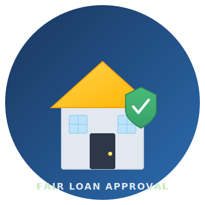

<div align="center">
  
  <h1 align="center">Fair Loan Approval</h1>
  <p align="center"><strong>Predicting home-loan default risk with machine learning &mdash; fair, transparent, data-driven lending decisions.</strong></p>
  <p align="center">
    
    
    
    
  </p>
</div>

---

## Why this project exists

The **2008 global financial crisis** was the worst economic disaster since the Great Depression. At its core was a simple failure: banks approved home loans to people who could not afford to repay them. Mortgages were bundled into opaque financial products, risk was obscured, and when borrowers defaulted, the entire system collapsed. Millions lost their homes, their savings, and their livelihoods.

Almost two decades later, the same fundamental question remains: *&ldquo;Can this applicant repay this loan?&rdquo;*

Traditional credit scoring is often opaque, biased against the underbanked, and fails to capture the full picture of an applicant&rsquo;s financial health. This project replaces guesswork with evidence &mdash; using machine learning to assess default risk in a way that is **fair, transparent, and explainable**.

### Humanitarian mission

> *&ldquo;Homeownership is the foundation of the middle class.&rdquo;*

For the **underprivileged and underbanked**, accessing credit is one of the hardest barriers to homeownership. When lending decisions are based on limited data or biased heuristics, qualified applicants get rejected and wealth gaps widen.

This project serves a dual purpose:

| Objective | Description |
|-----------|-------------|
| **Business** | Help lenders accurately assess credit risk, reduce non-performing loans, and make data-driven portfolio decisions. |
| **Humanitarian** | Give **every applicant &mdash; regardless of background &mdash; a fair, data-driven evaluation**. If the data says they can afford the loan, they deserve approval. If not, they are protected from taking on debt they cannot handle. |

We are not just approving loans. We are enabling **sustainable homeownership** and helping prevent the next crisis.

---

## The model

The pipeline trains a **CatBoost classifier** with **stratified 5-fold cross-validation** on the Home Credit Default Risk dataset (307,511 training applications, 197 features). The model learns patterns from bureau data, credit-card balances, installment payments, POS cash loans, and previous applications to predict the probability of default.

**Key characteristics:**

| Metric | Value |
|--------|-------|
| CV ROC-AUC | **0.783** (mean across 5 folds) |
| Features | 197 (numerical + 21 categorical) |
| Training samples | 307,511 |
| Test samples | 48,744 |
| Class balance | 8.1% default rate |

The ensemble of 5 fold models is served via REST API, producing an averaged prediction that is more robust than any single model.

---

## Technologies used

| Technology | Purpose |
|------------|---------|
| [Python 3.10+](https://python.org) | Core language |
| [CatBoost](https://catboost.ai) | Gradient-boosting decision trees with native categorical-feature support |
| [scikit-learn](https://scikit-learn.org) | Cross-validation (StratifiedKFold), ROC-AUC evaluation |
| [Pandas / NumPy](https://pandas.pydata.org) | Data loading, transformation, feature engineering |
| [FastAPI](https://fastapi.tiangolo.com) | REST API serving with automatic OpenAPI docs |
| [Uvicorn](https://www.uvicorn.org) | ASGI server |
| [PyArrow](https://arrow.apache.org) | Parquet file I/O |

---

## Project structure

```
Housing_loans_approval/
├── main.py                         # CLI: train, predict, or full pipeline
├── config/config.py                # All paths, parameters, and settings
├── src/
│   ├── data/loader.py              # Parquet loading
│   ├── features/
│   │   ├── builder.py              # Merge auxiliary tables + categorical handling
│   │   └── schema.py               # Persist/load feature schema for serving
│   ├── models/catboost_model.py    # CatBoost wrapper
│   ├── pipeline/
│   │   ├── train.py                # CV training with OOF predictions
│   │   └── predict.py              # Batch inference + submission CSV
│   ├── serving/
│   │   ├── app.py                  # FastAPI application
│   │   ├── ensemble.py             # Fold-model ensemble for serving
│   │   └── static/                 # Web UI
│   │       ├── logo.svg            # Project logo
│   │       └── index.html          # Business-oriented assessment dashboard
│   └── utils/logger.py             # Structured logging (stdout + file)
├── tests/
│   ├── test_pipeline.py            # 5 smoke tests for the pipeline
│   └── test_serving.py             # 6 tests for the REST API
├── outputs/                        # Auto-created artifacts
│   ├── models/                     # Trained fold models + feature schema
│   ├── submissions/                # Kaggle-format submission CSV
│   └── reports/                    # Feature importance + run logs
└── requirements.txt
```

---

## Quick start

### 1. Clone & install

```bash
git clone https://github.com/meddhib/home-loan-default-risk.git
cd home-loan-default-risk
pip install -r requirements.txt
```

### 2. Train the model

```bash
python main.py train
```

This loads all parquet files from `/home/mohamed/Desktop/project` (override with `--data-dir`), merges auxiliary tables, performs 5-fold cross-validation with CatBoost, and writes:
- `outputs/models/model_fold{1..5}.cbm`
- `outputs/submissions/submission.csv`
- `outputs/reports/feature_importance.csv`
- `outputs/reports/run.log`

### 3. Start the API server

```bash
uvicorn src.serving.app:app --host 0.0.0.0 --port 8007
```

### 4. Open the dashboard

Navigate to **[http://localhost:8007](http://localhost:8007)** in your browser.

### 5. Make a prediction

```bash
curl -X POST http://localhost:8007/predict \
  -H "Content-Type: application/json" \
  -d '{
    "CODE_GENDER": "F",
    "FLAG_OWN_CAR": "Y",
    "AMT_INCOME_TOTAL": 180000,
    "AMT_CREDIT": 450000,
    "AMT_ANNUITY": 27000,
    "AMT_GOODS_PRICE": 540000,
    "EXT_SOURCE_2": 0.65,
    "EXT_SOURCE_3": 0.60,
    "NAME_INCOME_TYPE": "Working",
    "NAME_EDUCATION_TYPE": "Higher education"
  }'
```

Response:
```json
{
  "score": 0.042,
  "decision": "approve",
  "threshold": 0.5
}
```

---

## API endpoints

| Method | Path | Description |
|--------|------|-------------|
| GET | `/` or `/ui` | Business-oriented assessment dashboard |
| GET | `/health` | Service and model status |
| GET | `/features` | List all 197 expected features |
| POST | `/predict` | Single application prediction |
| POST | `/predict_batch` | Batch predictions |

Interactive API docs at **[http://localhost:8007/docs](http://localhost:8007/docs)**.

---

## Running the tests

```bash
python -m pytest tests/ -v
```

11 tests covering both the pipeline (data loading, feature building, model training, submission writing) and the serving layer (health, features, predict, batch predict, sparse input, empty batch).

---

## Data

The pre-processed Home Credit parquet files should be placed in a data directory (default: `/home/mohamed/Desktop/project`):

| File | Description |
|------|-------------|
| `train(1).parquet` | 307,511 training applications with 121 features + TARGET |
| `test(1).parquet` | 48,744 test applications |
| `bureau_agg_curr.parquet` | Aggregated credit bureau data |
| `previous_application(1).parquet` | Previous loan applications |
| `credit_balance.parquet` | Credit card balance history |
| `installments(1).parquet` | Installment payment history |
| `pos_cash(1).parquet` | POS cash loan history |

---

## License

This project is released under the MIT License.

---

<div align="center">
  <strong>Fair lending is not just good business &mdash; it is the right thing to do.</strong>
  <br><br>
  <em>Built with care after the lessons of 2008.</em>
</div>
